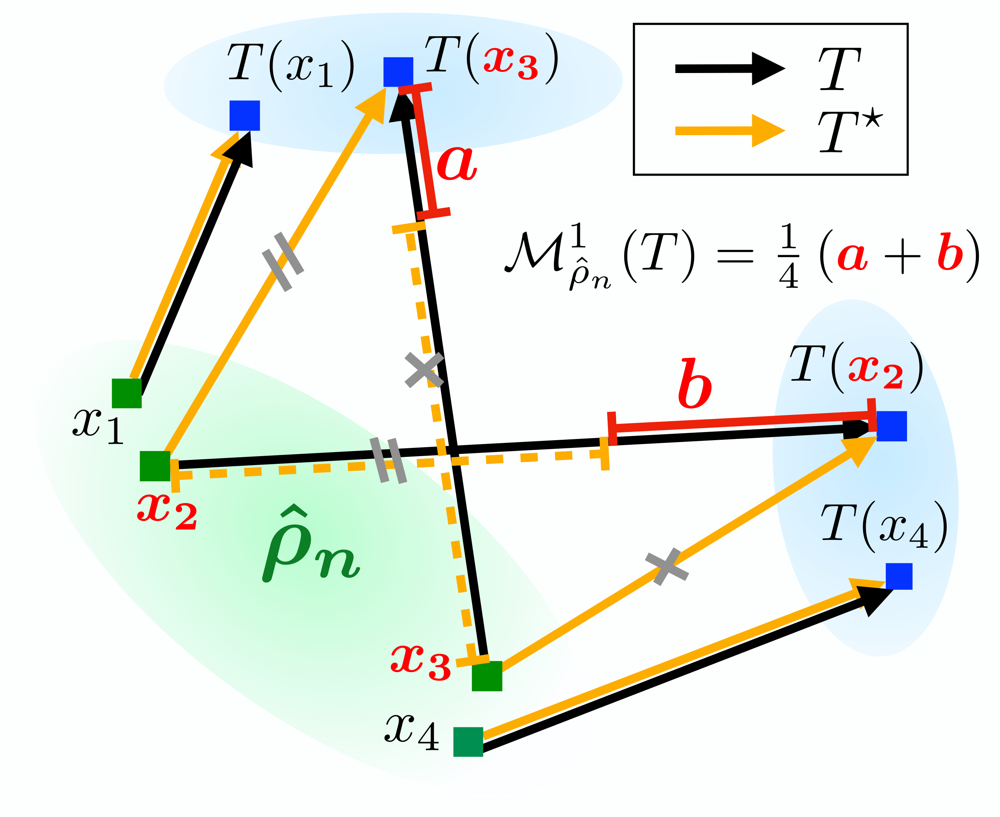

# The Monge gap (unofficial implementation)



## Project description

Original paper: https://arxiv.org/abs/2302.04953.

Project report and its presentation can be found in the ```docs``` folder.

## Computational resources

All the models were trained using Colab, Kaggle or DataSphere environments with GPU configuration selected (T4 for Colab, P100 for Kaggle and V100 for DataSphere).

## Possible improvements

- Experiment with MLP's hidden layers sizes.
- Use alternative Sinkhorn algorithm implementations (at least increase the number of iterations).
- For single-cell genomics dataset, test the method for all 34 treatments within 4i part.